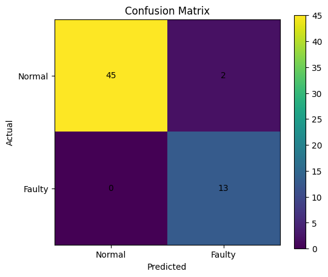
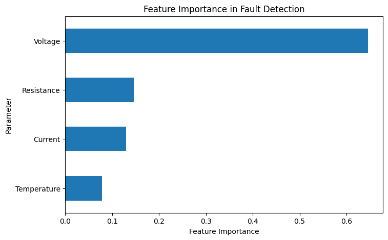

# Machine Learning-Based Electronic Component Fault Detection

## Overview

This project demonstrates a machine learning approach for detecting
potential electronic component faults using electrical and thermal
parameters.

The model classifies a component as either:

- Normal
- Faulty

## Objective

The objective is to demonstrate how machine learning can be applied
to electronic system monitoring and fault detection.

## Parameters Used

The model uses four input parameters:

- Voltage
- Current
- Temperature
- Resistance

## Machine Learning Model

A Random Forest Classifier was implemented using Scikit-learn.

### Workflow

Electrical Parameters
        ↓
Data Generation
        ↓
Data Preprocessing
        ↓
Train/Test Split
        ↓
Random Forest Classifier
        ↓
Fault Prediction
        ↓
Model Evaluation

## Technologies Used

- Python
- NumPy
- Pandas
- Scikit-learn
- Matplotlib
- Google Colab

## Model Performance
## Results

### Confusion Matrix

The confusion matrix shows the classification performance of the Random Forest model on the test dataset.



### Feature Importance

The feature importance plot shows the relative contribution of each electrical and thermal parameter to the model's predictions.



The model achieved approximately 96.67% accuracy on the test dataset.

Evaluation metrics included:

- Accuracy
- Precision
- Recall
- F1-score
- Confusion Matrix

## Feature Analysis

Feature importance was calculated using the Random Forest model to
identify which electrical/thermal parameters contributed most to
the classification.

## Example Prediction

The trained model can be given new electrical measurements and
predict whether the component is:

`NORMAL`

or

`FAULTY`

## Project Structure

```text
ML-Electronic-Fault-Detection/
│
├── ML_Electronic_Fault_Detection.ipynb
└── README.md
